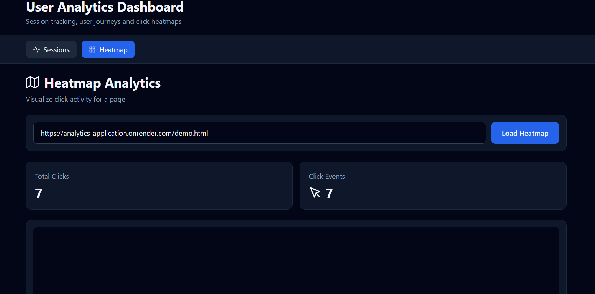
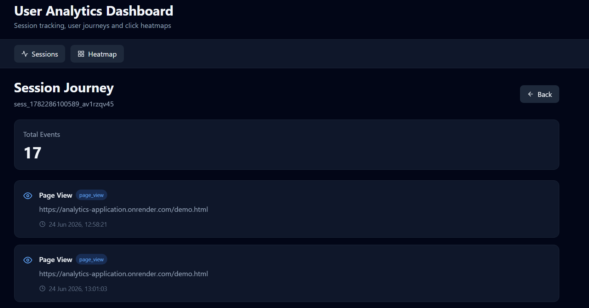
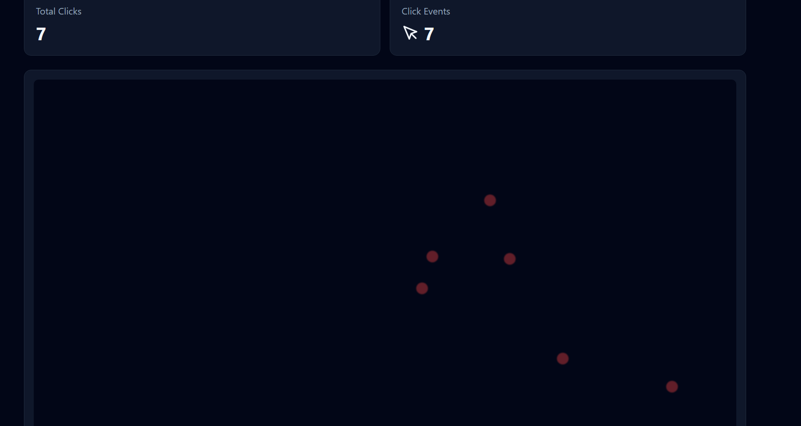
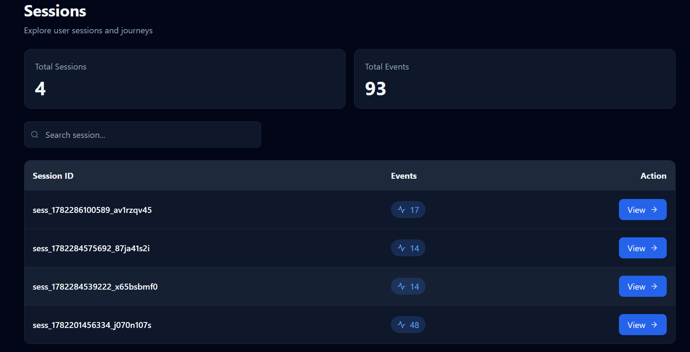
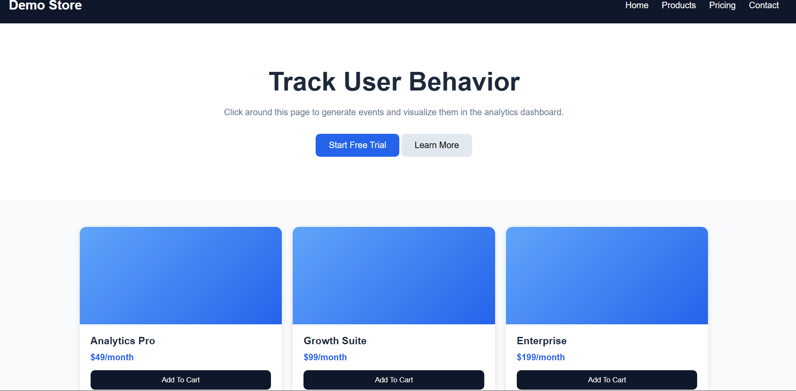

# 📊 Simple User Analytics Application

## 📌 Project Overview

A full‑stack web application that tracks user interactions (page views & clicks) on a webpage and visualizes them in a dashboard. Built with Node.js + Express, MongoDB, and React.

## 🌐 Live Demo

Here is the URL of webApp: https://analytics-application.onrender.com/

Live URL of the demo website: https://analytics-application.onrender.com/demo.html

<br>

## Screeenshots 

- 📸  Dashboard

 

<br>

- Activity

 

<br>

- HeatMap

 

<br>

- Sessiosn list

 


<br>

-  Demo Page

 


## 🛠 Tech Stack
| Layer           | Technology                      |
| --------------- | ------------------------------- |
| Backend         | Node.js, Express.js, Mongoose   |
| Database        | MongoDB (MongoDB Atlas)         |
| Frontend        | React (CRA) , Taliwincss        |
| Tracking        | JavaScript                      |
| Deployment      | Render                          |
| Version Control | Git & GitHub                    |


## 📂 Project Structure
```
analytics-app/
├── backend/
│   ├── public/       # static files (demo page, tracker script)
│   ├── models/Event.js
│   ├── routes/events.js
│   ├── routes/sessions.js
│   ├── server.js
│   ├── .env
│   └── package.json
└── frontend/
    ├── src/
    │   ├── api.js
    │   ├── components/
    │   │   ├── SessionsList.js
    │   │   ├── SessionJourney.js
    │   │   └── Heatmap.js
    │   ├── App.js
    │   └── index.js
    ├── package.json
    └── README.md
READEME.md
```

## ⚙️ Installation

## 1. Clone Repository

```
git clone https://github.com/Amit-yadav099/Analytics-Application.git

cd Analytics-Application
```


## 2. Install Frontend Dependencies
```
cd frontend
npm install
```
 
## 3. Install Backend Dependencies
```
cd ../backend
npm install
```
 add the .env file in the backend root directoy.

-  🔐 Environment Variables

Create a .env file inside backend directory.
```
PORT=5000

MONGO_URI=your_mongodb_connection_string
```

now, change the API_URL of the file backend/public/tracker.js to local URL of the demo file. i.,e [(http://localhost:5000/demo.html)](http://localhost:5000/demo.html#)


## - ▶️ Running Locally
  - Start Backend

```
cd backend
npm run dev
```

Backend runs on: http://localhost:5000
 -  Start Frontend
```
cd frontend
npm start
```
Frontend runs on: http://localhost:3000

## 4. Test the Tracking
The demo page is served from the backend at http://localhost:5000/demo.html.
Open it in your browser – it will automatically send page_view and click events to the backend.

You can also serve the tracking script on any other webpage by including:
```
<script src="http://localhost:5000/tracker.js"></script>
```

## 🖥️ Dashboard Features
- Sessions View: Shows all sessions with event counts. Click a session to see its chronological event journey.

- Heatmap View: Enter a page URL to see click positions overlaid on a grid.


## 🧪 Assumptions & Trade‑offs
- Session ID: Stored in localStorage (persistent across tabs and browser restarts).

- Click Coordinates: clientX/Y are sent relative to the viewport. A production heatmap would need to account for page scroll and element positions.

- Event Batching: Events are sent one by one. For high traffic, consider batching or using sendBeacon for unload events.

- No Authentication: The app does not include user auth – it’s a demo.

- Heatmap Grid: The grid size is fixed (800x600) – in reality, you’d match the page’s viewport size.

## 🚀 Deployment

The application is deployed as a monolithic full-stack application, where both the React frontend and Express backend are served from the same 
server.

Deployment Architecture
```
React Dashboard
       │
       ▼
Express Server
       │
 ┌─────┴─────┐
 ▼           ▼
API Routes   Static Assets
             (demo.html, tracker.js)
       │
       ▼
MongoDB Atlas
```
- Hosting
  - Frontend + Backend: Render
  -  Database: MongoDB Atlas

- Production Build Process
 
  - Build the React application using:

```
npm run build
```

- Serve the generated React build from the Express server.
- Serve static assets (demo.html and tracker.js) through Express.
- Connect the application to MongoDB Atlas using environment variables.


## 👨‍💻 Author
Amit Yadav